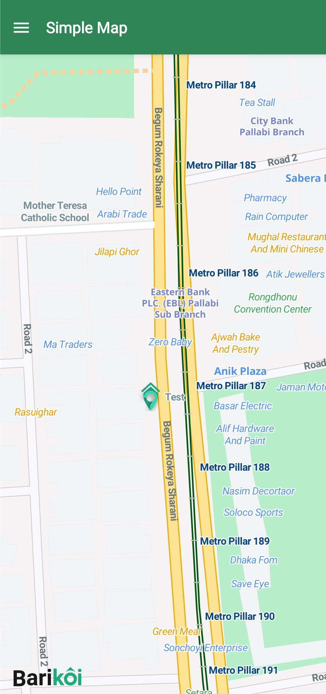
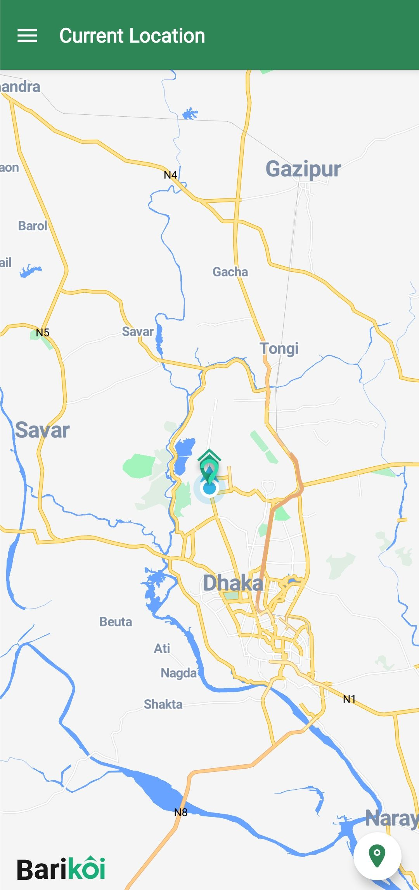
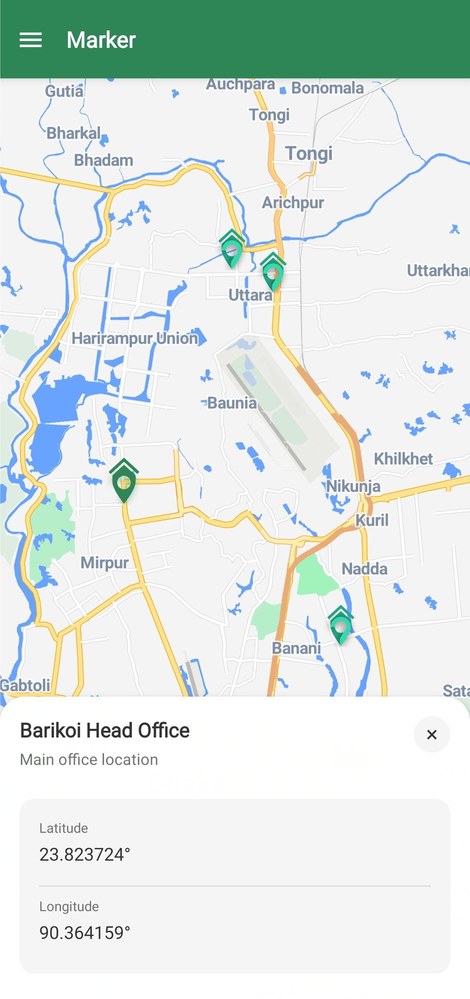
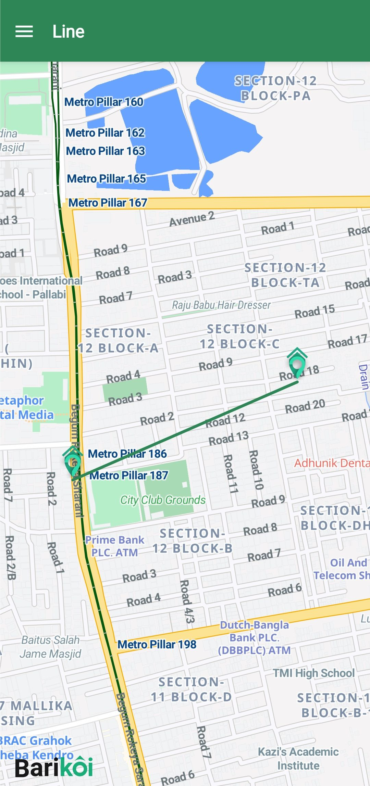
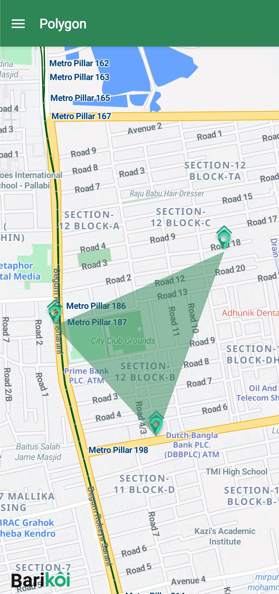
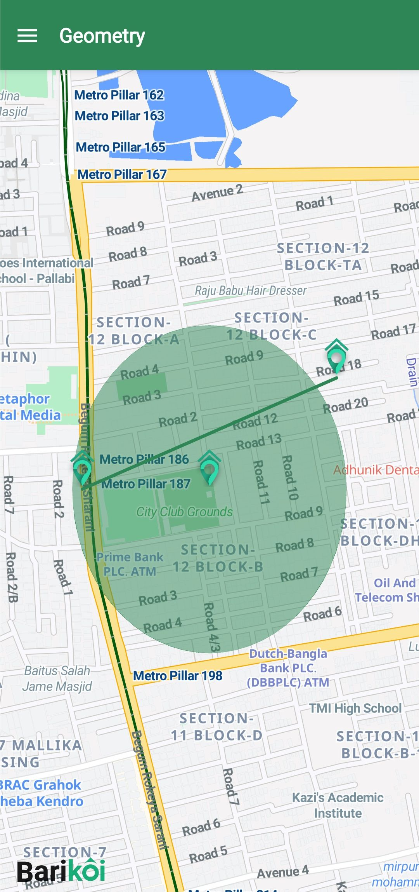
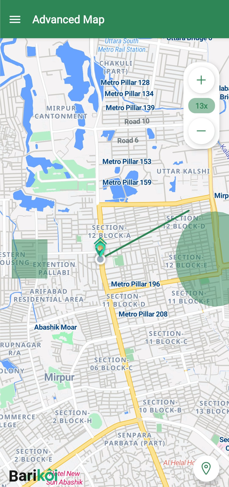

# 🗺️ React Native (Expo) Map App with Barikoi Maps

A comprehensive React Native (Expo) application demonstrating various map features using **Barikoi Maps**, Bangladesh's leading mapping service, integrated with **@maplibre/maplibre-react-native**. This project serves as a complete example for the React Native community.

## 🔑 IMPORTANT: Get Your API Key First!

⚠️ **Before running this project, you MUST:**

1. Visit [https://developer.barikoi.com](https://developer.barikoi.com) and create an **account**
2. Get your API key from the dashboard -> account -> API Key
3. Replace `YOUR_API_KEY_HERE` in `utils/mapUtils.ts`

❌ **The app will NOT work without a valid API key!**

## 📦 Version Info

- **Project Version**: 1.0.0
- **React Native**: 0.72.6
- **Expo**: ~49.0.15
- **@maplibre/maplibre-react-native**: ^9.1.0
- **expo-location**: ~16.1.0

## 📚 Documentation

This project includes comprehensive documentation to help you get started and build advanced features.

- **[README.md](./README.md)**: You are here! Project overview and quick start guide.
- **[DEVELOPER_GUIDE.md](./docs/DEVELOPER_GUIDE.md)**: A deep dive into the project structure, components, and advanced concepts.

## 📱 Features

### ✨ Core Map Features

- **Simple Map Display**: Basic map rendering with Barikoi's style.
- **Current Location**: Real-time user location tracking with permission handling.
- **Custom Markers**: Interactive, custom-styled markers.
- **Line Drawing**: Draw lines (polylines) between coordinates.
- **Polygon Shapes**: Create and display polygon areas.
- **Complex Geometry**: Combine multiple geometric shapes on a single map.

### 🎨 UI/UX

- **Drawer Navigation**: Easy access to all map examples.
- **Loading & Error States**: Smooth user experience during network requests.
- **Centralized Utilities**: Reusable hooks and functions for clean code.

## 🚀 Quick Start (Complete Beginner Guide)

### Prerequisites (Check These First!)

- **Node.js v18+** (Download from [nodejs.org](https://nodejs.org))
- **Expo CLI**: `npm install -g @expo/cli`
- **A code editor** (VS Code recommended)
- **Android Studio** (for Android development) OR **Xcode** (for iOS development, macOS only)
- **Barikoi API Key** (Free registration at [https://developer.barikoi.com](https://developer.barikoi.com/))

### Step-by-Step Setup for Beginners

#### 1. Clone and Install Dependencies

```bash
# Clone the repository
git clone https://github.com/barikoi/react-native-map-example.git
cd react-native-map-example

# Install all dependencies
npm install

# Install iOS dependencies (macOS only)
cd ios && pod install && cd ..
```

#### 2. Add Your API Key (CRITICAL STEP!)

1. Get your API key from the [dashboard](https://developer.barikoi.com/dashboard) -> [account](https://developer.barikoi.com/account) -> API Key
2. Open `utils/mapUtils.ts` in your code editor
3. Replace this line:

```typescript
const BARIKOI_API_KEY = "YOUR_API_KEY_HERE";
```

With your actual key:

```typescript
const BARIKOI_API_KEY = "bkoi_xxxxxxxxxxxxx"; // Your actual key here
```

#### 3. Run the Project

```bash
# Start development server
npm start

# In another terminal, run on your device/simulator
npm run android  # For Android
# OR
npm run ios      # For iOS (Mac only)
```

#### 4. Test on Your Device

- Install **Expo Go** app on your phone
- Scan the QR code from terminal
- Grant location permissions when prompted

## Development Environment Setup

> **⚠️ Important**: This project uses `@maplibre/maplibre-react-native` which requires specific Expo configuration. Make sure to follow the [MapLibre Expo Setup Guide](https://maplibre.org/maplibre-react-native/docs/setup/expo) to verify your configuration is correct.

#### For iOS (macOS only)

1. Install Xcode from the Mac App Store
2. Install Xcode Command Line Tools:
   ```bash
   xcode-select --install
   ```
3. Install CocoaPods:
   ```bash
   sudo gem install cocoapods
   ```

#### For Android

1. Install Android Studio
2. Install Android SDK (minimum SDK 21)
3. Set up Android environment variables (ANDROID_HOME)
4. Create an Android Virtual Device (AVD)

## 🧪 Testing Your Setup

After installation, verify everything works:

1. **Start the app**: `npm start`
2. **Check the console**: Should show "Metro waiting on exp://..."
3. **Open on device**: Scan QR code with Expo Go app
4. **Test basic map**: Should see a map of Dhaka loading within 5-10 seconds
5. **Test location**: Grant permission and check if current location shows

✅ **If all steps work, you're ready to build amazing maps!**

## 🚨 Common Beginner Mistakes & Solutions

### ❌ "Map is blank/not loading"

**Solutions:**

- ✅ Check if you added your API key correctly in `utils/mapUtils.ts`
- ✅ Make sure you're connected to internet
- ✅ Verify the API key is active on Barikoi dashboard
- ✅ Check browser console for error messages

### ❌ "App crashes on startup"

**Solutions:**

- ✅ Run `npm install` again
- ✅ Clear Metro cache: `npm start -- --clear`
- ✅ Make sure you have Node.js v18+ installed
- ✅ For iOS: `cd ios && pod install && cd ..`

### ❌ "Location not working"

**Solutions:**

- ✅ Test on a real device (not simulator for best results)
- ✅ Allow location permissions when prompted
- ✅ Make sure location services are enabled on your device
- ✅ Check if GPS is working in other apps

### ❌ "Build errors with MapLibre"

**Solutions:**

- ✅ Follow the [MapLibre Expo Setup Guide](https://maplibre.org/maplibre-react-native/docs/setup/expo)
- ✅ Ensure your `app.json` has the correct plugin configuration
- ✅ Run `npx expo install --fix` to fix version conflicts

## 🖼️ Screenshots & Demo

### Core Features


_Basic map display with Barikoi styling_


_Real-time location tracking_


_Interactive custom markers_

### Advanced Features


_Draw lines between coordinates_


_Create polygon areas_


_Multiple geometric shapes_


_Advanced map with multiple features_

## 🏗️ How It Works (Quick Overview)

### Basic Map Setup

```typescript
import { Camera, MapView, MarkerView } from "@maplibre/maplibre-react-native";
import { useBarikoiMapStyle } from "../../utils/mapUtils";

export default function SimpleMapScreen() {
  const { styleJson, loading, error } = useBarikoiMapStyle();

  if (loading) return <ActivityIndicator />;
  if (error) return <Text>Error: {error}</Text>;

  return (
    <MapView style={styles.map} mapStyle={styleJson}>
      <Camera
        centerCoordinate={[90.364159, 23.823724]} // Dhaka coordinates
        zoomLevel={16}
      />
    </MapView>
  );
}
```

### Adding Markers

```typescript
<MarkerView coordinate={[90.364159, 23.823724]}>
  <Image source={require("../assets/icons/barikoi_icon.png")} />
</MarkerView>
```

### Location Tracking

```typescript
import * as Location from "expo-location";

// Request permission
const { status } = await Location.requestForegroundPermissionsAsync();

// Get current location
const location = await Location.getCurrentPositionAsync({});
```

## ❓ Frequently Asked Questions

**Q: Do I need to pay for Barikoi Maps?**
A: No, Barikoi offers a generous free tier for development and small projects.

**Q: Can I use this with my existing React Native app?**
A: Yes! Check the [DEVELOPER_GUIDE.md](./docs/DEVELOPER_GUIDE.md) for integration instructions.

**Q: Does this work on iOS simulator?**
A: Maps work fine, but location features work best on real devices.

**Q: How many API calls do I get for free?**
A: Check current limits on [Barikoi pricing page](https://barikoi.com/pricing).

**Q: Can I customize the map style?**
A: Yes! Barikoi provides multiple style options and custom styling capabilities.

**Q: Is this production-ready?**
A: Yes, this code follows React Native best practices and is suitable for production apps.

## 🔧 Customization Guide

### Adding a New Map Feature

1. **Create a new screen file**:

   ```bash
   touch components/screens/YourNewScreen.tsx
   ```

2. **Implement the component**:

   ```typescript
   import { MapView, Camera } from "@maplibre/maplibre-react-native";
   import { useBarikoiMapStyle } from "../../utils/mapUtils";

   export default function YourNewScreen() {
     const { styleJson, loading, error } = useBarikoiMapStyle();

     if (loading) return <ActivityIndicator />;
     if (error) return <Text>Error: {error}</Text>;

     return (
       <MapView mapStyle={styleJson}>
         {/* Your custom map features go here */}
       </MapView>
     );
   }
   ```

3. **Add to navigation**:
   Create a new file in the `app/` directory and add to `app/_layout.tsx`.

## 🚀 Publishing Your App (Complete Guide)

### Building for Production

```bash
# Install EAS CLI if you haven't already
npm install -g @expo/eas-cli

# Login to your Expo account
eas login

# Build for Android
eas build --platform android --profile production

# Build for iOS
eas build --platform ios --profile production
```

### For Google Play Store:

1. **Create Google Play Developer account** ($25 one-time fee)
2. **Build your app**: `eas build --platform android --profile production`
3. **Download APK/AAB** from Expo dashboard
4. **Upload to Google Play Console**
5. **Fill out store listing** (description, screenshots, etc.)
6. **Submit for review** (usually takes 1-3 days)

### For Apple App Store:

1. **Apple Developer account required** ($99/year)
2. **Build your app**: `eas build --platform ios --profile production`
3. **Download IPA** from Expo dashboard
4. **Use Transporter app** to upload to App Store Connect
5. **Fill out app information** in App Store Connect
6. **Submit for Apple review** (usually takes 1-7 days)

### EAS Build Configuration

This project includes a basic `eas.json` configuration:

```json
{
  "build": {
    "development": {
      "developmentClient": true,
      "distribution": "internal"
    },
    "preview": {
      "distribution": "internal"
    },
    "production": {}
  }
}
```

## ❗ Troubleshooting

### Common Issues & Solutions

1. **Map not displaying**

   - ✅ Check if your API key is correctly set in `utils/mapUtils.ts`
   - ✅ Ensure you have an active internet connection
   - ✅ Verify that the Barikoi servers are accessible
   - ✅ Check browser console for network errors

2. **Location permission issues**

   - ✅ For Android: Check if location permissions are granted in app settings
   - ✅ For iOS: Verify location permissions in Settings > Privacy > Location Services
   - ✅ Test on real device rather than simulator

3. **Build errors**

   - ✅ Clean the build cache:

     ```bash
     # Clear Metro cache
     npm start -- --reset-cache

     # For Android
     cd android && ./gradlew clean && cd ..

     # For iOS
     cd ios && pod deintegrate && pod install && cd ..
     ```

   - ✅ **Check MapLibre plugin**: Ensure proper configuration in `app.json`

4. **Marker/Shape rendering issues**

   - ✅ Ensure coordinates are in correct format [longitude, latitude]
   - ✅ Check if coordinates are within Bangladesh bounds
   - ✅ Verify GeoJSON structure for complex shapes
   - ✅ Test with simple coordinates first: `[90.364159, 23.823724]`

5. **Performance issues**
   - ✅ Use GeoJSON with ShapeSource for many markers
   - ✅ Enable clustering for dense marker areas
   - ✅ Optimize image sizes for custom markers
   - ✅ Implement proper loading states

### Getting Help

- 🐛 **Bug Reports**: [GitHub Issues](https://github.com/iazadur/expo-map-app/issues)
- 📧 **Barikoi Support**: support@barikoi.com
- 📖 **Documentation**: [docs.barikoi.com](https://docs.barikoi.com)
- 💬 **Community**: Join our Discord/Telegram for quick help

## 📄 License

This project is open source and available under the [MIT License](LICENSE).

## 🤝 Contributing

Contributions are welcome! Please:

1. Fork the repository
2. Create your feature branch (`git checkout -b feature/amazing-feature`)
3. Commit your changes (`git commit -m 'Add some amazing feature'`)
4. Push to the branch (`git push origin feature/amazing-feature`)
5. Open a Pull Request

For major changes, please open an issue first to discuss what you would like to change.

## 📞 Support & Resources

- **Barikoi Maps**: [https://barikoi.com](https://barikoi.com)
- **API Documentation**: [https://docs.barikoi.com](https://docs.barikoi.com)
- **MapLibre React Native**: [GitHub Repository](https://github.com/maplibre/maplibre-react-native)
- **Expo Documentation**: [https://docs.expo.dev](https://docs.expo.dev)

## 🎉 What's Next?

Once you have the basic app running, you can:

- Add search functionality with Barikoi Places API
- Implement route planning with Barikoi Route API
- Add real-time traffic data
- Integrate with your backend API
- Add offline map capabilities
- Implement custom map themes

---

**Built with ❤️ for the React Native community in Bangladesh.**

**Happy Mapping! 🗺️✨**
